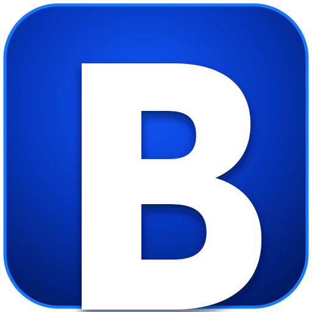

<div align="center">
  

# 🌊 BilaKey PC 2.5.5

### Bộ gõ Windows với **CVNSS4.0 Core** và **VNI/Telex hợp nhất**

<a href="https://github.com/xulytiengviet/BilaKey_PC/releases/download/2.5.5/BilaKey-PC-2.5.5-CVNSS-Core-x64.exe">
  
</a>

**Tải `.exe`, mở và dùng ngay — portable, không cần cài đặt.**

[](https://github.com/xulytiengviet/BilaKey_PC/releases/download/2.5.5/BilaKey-PC-2.5.5-CVNSS-Core-arm64.exe)
[](https://github.com/xulytiengviet/BilaKey_PC/releases/download/2.5.5/BilaKey-PC-2.5.5-CVNSS-Core-x86.exe)
[](https://github.com/xulytiengviet/BilaKey_PC/releases/download/2.5.5/BilaKey-PC-2.5.5-Windows.zip)
[](https://github.com/xulytiengviet/BilaKey_PC/releases/download/2.5.5/SHA256SUMS-2.5.5.txt)
[](https://github.com/xulytiengviet/BilaKey_PC/releases/tag/2.5.5)

[](VERSION)
[](LICENSE)
[](BUILD.md)
[](SECURITY.md)

**Nhanh · Nhẹ · Unicode · Offline · Riêng tư · Kiểm toán được · Mã nguồn mở MIT**
</div>

---

## ✨ Giao diện mới trong 2.5.5

BilaKey PC 2.5.5 nâng cấp toàn diện lớp UI/UX Win32:

- cửa sổ chính **1000 × 650 px**, rộng và dễ đọc hơn, tương đương khoảng một phần tư màn hình Full HD;
- logo chữ **B**, tên sản phẩm và định vị “Kiểu gõ dấu chữ tiếng Việt” được đặt ở vùng nhận diện riêng;
- hai thẻ kiểu gõ lớn, nhấn trực tiếp: **CVNSS4.0 · LÕI** và **VNI/TELEX · TỰ ĐỘNG**;
- thanh trạng thái riêng cho bật/tắt, kiểu gõ hiện hành và Unicode;
- thanh phím tắt riêng, không còn chen vào trạng thái;
- khu vực **THÔNG TIN** giải thích hai kiểu gõ và ghi rõ tác giả, dự án, giấy phép;
- năm nút thao tác lớn: **BẬT/TẮT · MỞ RỘNG · THÔNG TIN · HƯỚNG DẪN · THOÁT**;
- bảng màu xanh–trắng, chữ Segoe UI lớn hơn và độ tương phản tốt hơn.

Dòng nhận diện trong ứng dụng:

> **CVNSS4.0 Core, Unicode, riêng tư, kiểm toán được**  
> **Kiểu gõ dấu chữ tiếng Việt**

## ⌨️ Hai kiểu gõ

| Kiểu gõ | Giải thích |
|---|---|
| 🧠 **CVNSS4.0** | Kiểu gõ chuyên dụng lấy CVNSS4.0 làm lõi trung tâm, có candidate graph và resolver kiểm toán được. |
| 🔁 **VNI/Telex hợp nhất** | Gõ theo VNI hoặc Telex trong cùng một chế độ; hệ thống tự nhận dạng và xuất Unicode tiếng Việt. |

```text
Telex       tieengs   → tiếng
VNI         tieng61   → tiếng
Kết hợp     vieet5    → việt
Kết hợp     d9oongf   → đồng
CVNSS4.0    qyl       → quỳ
```

Cấu hình cũ `Telex`, `VNI` hoặc `Telex/VNI` tiếp tục được tự động chuyển sang `VNI/Telex`.

## 📦 Tải trực tiếp

| Thiết bị | Liên kết |
|---|---|
| **Windows x64 — khuyến nghị** | [BilaKey-PC-2.5.5-CVNSS-Core-x64.exe](https://github.com/xulytiengviet/BilaKey_PC/releases/download/2.5.5/BilaKey-PC-2.5.5-CVNSS-Core-x64.exe) |
| **Windows ARM64 / Snapdragon** | [BilaKey-PC-2.5.5-CVNSS-Core-arm64.exe](https://github.com/xulytiengviet/BilaKey_PC/releases/download/2.5.5/BilaKey-PC-2.5.5-CVNSS-Core-arm64.exe) |
| **Windows x86 32-bit** | [BilaKey-PC-2.5.5-CVNSS-Core-x86.exe](https://github.com/xulytiengviet/BilaKey_PC/releases/download/2.5.5/BilaKey-PC-2.5.5-CVNSS-Core-x86.exe) |
| **Gói đầy đủ Windows ZIP** | [BilaKey-PC-2.5.5-Windows.zip](https://github.com/xulytiengviet/BilaKey_PC/releases/download/2.5.5/BilaKey-PC-2.5.5-Windows.zip) |
| **Bảng kiểm tra SHA-256** | [SHA256SUMS-2.5.5.txt](https://github.com/xulytiengviet/BilaKey_PC/releases/download/2.5.5/SHA256SUMS-2.5.5.txt) |

Workflow chỉ kết thúc khi xác minh đủ **3 EXE + ZIP + SHA-256**.

> Bản portable chưa ký Authenticode; Windows SmartScreen có thể cảnh báo ở lần chạy đầu. Chỉ tải từ Release chính thức và kiểm tra SHA-256.

## 🎛️ Phím tắt

| Phím | Tác vụ |
|---|---|
| `Ctrl+Shift+Space` | Bật/tắt BilaKey |
| `Ctrl+Shift+1` | Chọn CVNSS4.0 |
| `Ctrl+Shift+2` | Chọn VNI/Telex |
| `Ctrl+Shift+0` | Đổi ứng viên CVNSS4.0 |
| `Shift` một lần | Viết hoa một từ |
| `Shift` hai lần | Bật/tắt BilaCaps |

## 🔨 Build từ mã nguồn

```bash
git clone https://github.com/xulytiengviet/BilaKey_PC.git
cd BilaKey_PC
go test ./...
GO_BIN=go scripts/build_release.sh
```

Yêu cầu: Go 1.23+, Node.js 22+, Python 3.12+, `g++` và `xz`.

## 🔐 Quyền riêng tư

BilaKey không có telemetry, quảng cáo, tài khoản người dùng hoặc network runtime. Quy tắc được nhúng tĩnh; cấu hình được ghi atomic trong thư mục người dùng.

## 🤝 Ghi nhận

- **Tác giả và phát triển:** **Long Ngo**.
- **Dự án nền tảng:** **CVNSS4.0**.
- **Hỗ trợ CVNSS4.0:** **NNC Trần Tư Bình** và cộng đồng CVNSS4.0/BilaKey.
- **Cộng đồng:** [CVNSS4.0 và Bộ gõ BilaKey](https://www.facebook.com/groups/251479779599477).
- **Giấy phép:** **MIT**.

```text
Copyright (c) 2026 Long Ngo
```
